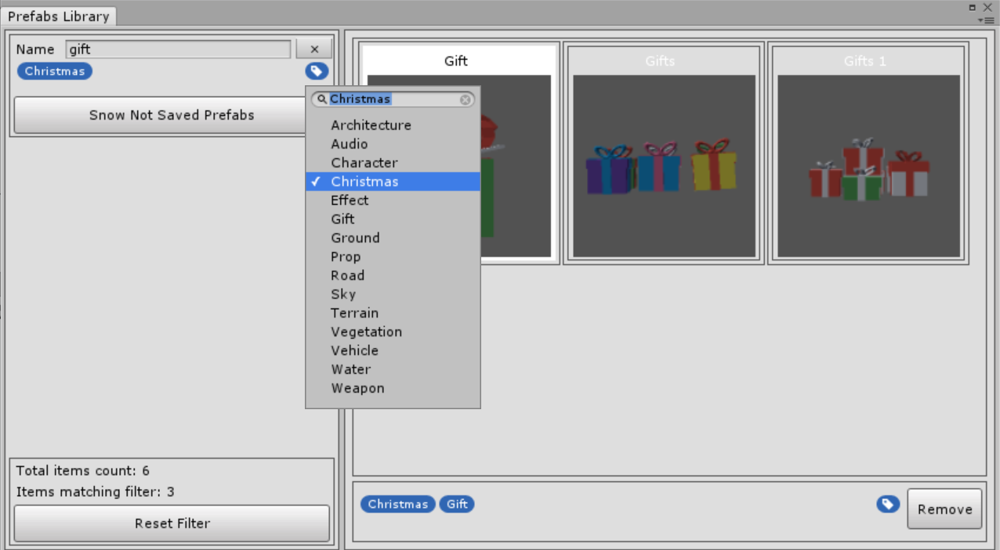
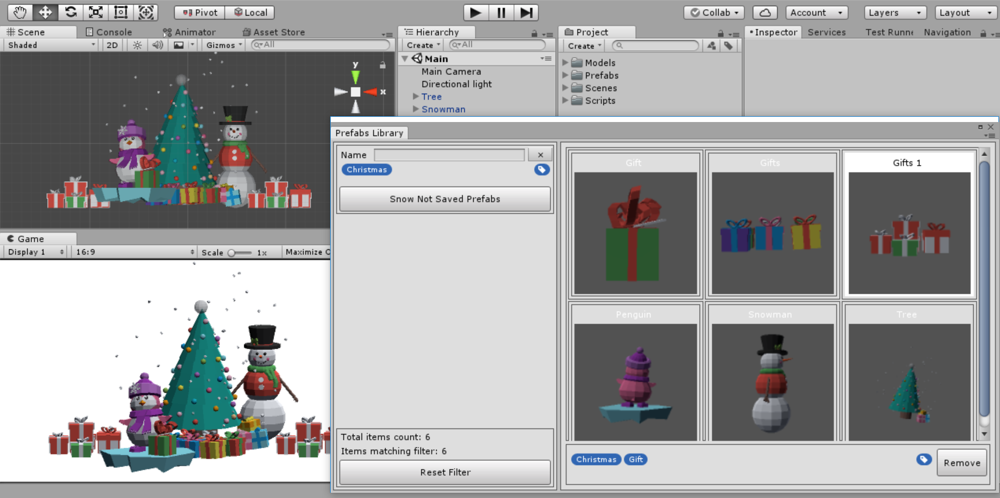

# Unity-Prefabs-Library

A custom Editor window for managing prefabs where you can easily add prefabs, assign labels to them and find prefabs by specific name or label (searching functionality can be extended to support more variables such as type, quantity etc.)

Supports Drag and Drop for both adding new prefabs and instantiating already added prefabs so you can easily construct a scene using only Prefabs Library window.

